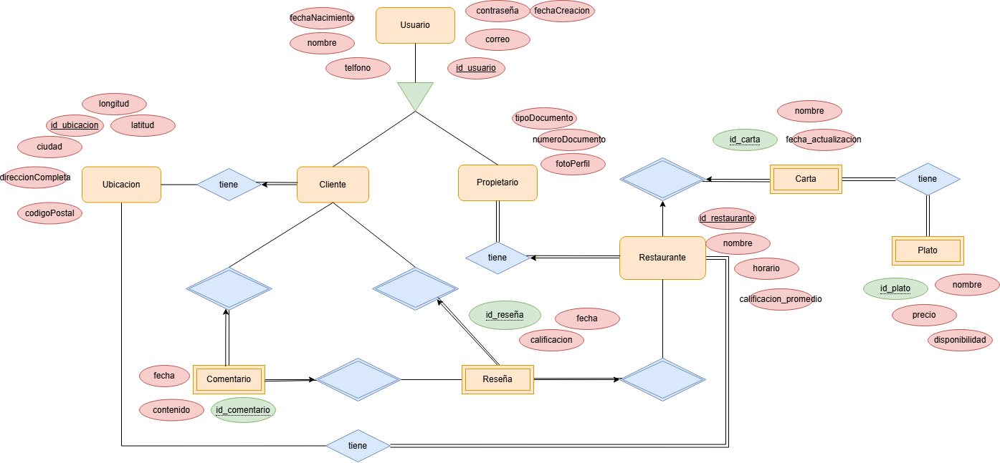

# ENTREGABLE DE PROYECTO: PLATEFUL BACKENDd

---

## Curso de Desarrollo Basado en Plataformas

## Integrantes:
| Nombre                     
|----------------------------
| Diego Alexis Gil Rojas 
| Marco Apolinario Lainez   
| David Huette Ospino
| Anel Rojas Martinez 

---

# Índice
- [Introducción](#introducción)
   1. [Contexto del proyecto](#1-contexto-del-proyecto)
   2. [Objetivos](#2-objetivos)
- [Identificación del Problema o Necesidad](#identificación-del-problema-o-necesidad)
   1. [Descripción del problema](#3-descripción-del-problema)
   2. [Justificación del problema](#4-justificación-del-problema)
- [Descripción de la Solución](#descripción-de-la-solución)
   1. [Funcionalidades Clave](#5-funcionalidades-clave)
   2. [Tecnologías Usadas](#6-tecnologías-usadas)
- [Modelo de Entidades](#modelo-de-entidades)
   1. [Diagrama Entidad-Relación](#7-diagrama-entidad-relación)
   2. [Descripción de Entidades](#8-descripción-de-entidades)
      - [Entidades básicas identificadas](#entidades-básicas-identificadas)
      - [Atributos](#atributos)
      - [Relaciones](#relaciones)
- [Testing y Manejo de Errores](#testing-y-manejo-de-errores)
   1. [Niveles de Testing Realizados](#9-niveles-de-testing-realizados)
   2. [Resultados](#10-resultados)
   3. [Manejo de Errores](#11-manejo-de-errores)
- [Medidas de Seguridad Implementadas](#medidas-de-seguridad-implementadas)
   1. [Seguridad de Datos](#12-seguridad-de-datos)
   2. [Prevención de Vulnerabilidades](#13-prevención-de-vulnerabilidades)
- [Eventos y Asincronía](#eventos-y-asincronía)
   1. [Descripción de Eventos](#14-descripción-de-eventos)
- [GitHub](#github)
   1. [Utilización de GitHub Projects](#15-utilización-de-github-projects)
   2. [Utilización de GitHub Actions](#16-utilización-de-github-actions)
- [Conclusión](#conclusión)
   1. [Logros del Proyecto](#17-logros-del-proyecto)
   2. [Aprendizajes Clave](#18-aprendizajes-clave)
   3. [Trabajo Futuro](#19-trabajo-futuro)
- [Apéndices](#apéndices)
   1. [Licencia](#20-licencia)
   2. [Referencias](#21-referencias)

---

## Introducción

### 1. Contexto del proyecto:

### 2. Objetivos:

- Facilitar la conexión entre clientes y restaurantes en una misma zona.
- Permitir que los usuarios puedan ver menús, precios y disponibilidad de platos en tiempo real.
- Ofrecer a los restaurantes una plataforma para gestionar sus menús, recibir reseñas y responder a las críticas de los clientes.
- Fomentar la interacción entre restaurantes y clientes mediante un foro de comentarios.
- Crear un sistema de evaluación de restaurantes por parte de los usuarios, permitiendo calificaciones de 1 a 5 estrellas.

---
## Identificación del Problema o Necesidad

### 3. Descripcion del problema:
En un entorno donde las opciones para comer son cada vez más diversas y donde la gente busca experiencias de comida cercanas y accesibles, surge la necesidad de conectar a los clientes con los restaurantes locales de una manera simple y eficiente.

**Plateful** busca ser una solución tanto para los clientes que desean descubrir los mejores restaurantes cercanos a su ubicación, como para los restaurantes que desean ofrecer sus menús y recibir retroalimentación directa de sus clientes. La plataforma permitirá a los usuarios evaluar y comentar sobre los restaurantes, así como a los restaurantes gestionar su oferta gastronómica de forma dinámica.

### 4. Justificación del problema

Con la creciente oferta de restaurantes y opciones de comida, las personas a menudo no tienen la información suficiente para elegir dónde comer, basándose en criterios como proximidad, menú y opiniones de otros clientes.

Por otro lado, muchos restaurantes carecen de una plataforma fácil de usar para compartir su oferta actualizada y recibir retroalimentación. **Plateful** ofrece una solución a ambos problemas, conectando a clientes y restaurantes en una misma aplicación.

---
## Descripción de la Solución

### 5. Funcionalidades Clave

- **Registro de usuarios**: Los clientes y restaurantes podrán registrarse en la plataforma seleccionando su rol.
- **Localización geográfica**: Los usuarios podrán visualizar los restaurantes cercanos a su ubicación actual, que estén registrados en la app.
- **Visualización de menús**: Los restaurantes podrán subir sus menús, con precios y disponibilidad de platos actualizados en tiempo real.
- **Evaluación de restaurantes**: Los clientes podrán puntuar los restaurantes de 1 a 5 estrellas después de cada visita.
- **Foro de comentarios**: Los restaurantes podrán interactuar con los clientes respondiendo a sus críticas o agradeciendo sus reseñas.
- **Gestión de restaurantes**: Los restaurantes tendrán una sección para gestionar sus menús, horarios y precios.

### 6. Tecnologias Usadas
Nuestro proyecto emplea una arquitectura modular y escalable, organizada en capas distintas que encapsulan funcionalidades específicas como:
 - Gestión de entidades, controladores y repositorios
 - Objetos de transferencia de datos (DTO) 
 - Manejo eventos e implementación de seguridad

A continuación, se describen las tecnologías utilizadas:

- **Lenguaje de Programación**: Java
- **Frameworks y Librerías**:
    - **Spring Boot**: Para el desarrollo del backend.
- **Herramientas de Persistencia**:
    - **Spring Data JPA**: Para la gestión de la persistencia.
- **Base de Datos**:
    - **PostgreSQL**: Base de datos robusta y escalable.
- **Entorno de Desarrollo**:
    - **Maven**: Para la gestión de dependencias.
- **Control de Versiones**:
    - **Git**: Para el control de versiones del código.
    - **GitHub**: Repositorio para la colaboración y gestión del código.
- **API Externas**:
    - **API de Google Maps**: Utilizada para la ubicacion de los usuarios. 

---

## Modelo de entidades

### 7. Diagrama Entidad-Relacion

### 8. Descripcion de Entidades

#### Entidades básicas identificadas

- **Usuario**: 
  - Clientes o dueños
  - Posee un `id` (PK) al momento del registro
  - Solicita un `nombre`, `correo`, una `contraseña` y el `rol`.

- **Restaurante**:
  - Se selecciona al registrarse como dueños
  - Posee un `id` (PK)
  - Al momento del registro pedirá un `nombre_restaurante`, la `ubicación`, `horario de atención` y el `propietario` (FK de Usuario)
  - Se solicitará una `carta` y cada restaurante podrá recibir una `reseña` junto con `comentarios`.

- **Reseña**:
  - Establecida por un usuario de tipo cliente
  - Se expresa en una `calificación` del 1 al 5 (representada por estrellas)
  - Posee un `id_reseña` (PK) y es establecida por un `id_usuario` (FK) y repercute en un `id_restaurante` (FK)
  - También se establece una media de calificación entre la cantidad de usuarios que califiquen.

- **Carta**:
  - Espacio para la gestión y visibilidad de `Platos`
  - El dueño crea su propia carta que posee un `id` único (`id_carta` PK)
  - Se le podrá agregar un `nombre` y su `última fecha de actualización`.

- **Plato**:
  - Dependiendo de la carta creada (`id_carta` FK Carta), se agregarán los platos que hay en la misma
  - Los platos tendrán un `id` único (`id_plato`)
  - Se le podrá asignar un `nombre` al plato
  - También se crea un atributo `disponibilidad` (para saber si aún no se ha acabado el plato).

- **Comentarios**:
  - Entidad creada para que el `Usuario` pueda dejar sus comentarios en alguna `Reseña`
  - Cada comentario será guardado con un `id` único
  - Tendrán su `contenido` y la `fecha de publicación`.

### Atributos

#### Usuario
- `id_usuario` (PK)
- `fecha_nacimiento`
- `nombre`
- `correo`
- `contraseña`
- `telefono`

#### Ubicacion
- `id_ubicacion`
- `latitud`
- `longitud`
- `ciudad`
- `direccionCompleta`
- `codigoPostal`

#### Cliente
- `Usuario.id_usuario` (PK FK a `id_usuario`)
- `ubicacionActual` (FK a `id_ubicacion`)

#### Propietario
- `Usuario.id_usuario` (PK FK)
- `tipoDocumento`
- `numeroDocumento`
- `fotoPerfil`

#### Restaurante
- `id_restaurante` (PK)
- `nombre_restaurante`
- `ubicación`
- `horario`
- `propietario` (FK de a `Propietario.id_usuario`)
- `tipoRestaurante` (Menú/Chifa/Comida Rápida/etc.)
- `calificación_promedio`

#### Reseña
- `id_reseña` (PK)
- `calificación` (1 a 5 estrellas)
- `id_usuario` (FK de `Cliente.id_usuario`)
- `id_restaurante` (FK de `Restaurante`)
- `fecha`

#### Carta
- `id_carta` (PK)
- `id_restaurante` (FK `Restaurante`)
- `nombre`
- `fecha_actualizacion`

#### Plato
- `id_plato` (PK)
- `id_carta` (FK `Carta`)
- `nombre`
- `precio`
- `disponibilidad`

#### Comentario
- `id_comentario` (PK)
- `id_reseña` (FK `Reseña`)
- `id_usuario` (FK `Cliente.id_usuario`)
- `contenido`
- `fecha`

#### Relaciones

- Cada Cliente tiene un sola ubicacion: Relacion de many-to-one, con participacion total, entre `Cliente` y `Ubicacion` donde `id_ubicacion` es FK en `Cliente`.
- Cada Restaurante tiene una o mas ubicaciones: Relacion many-to-many, con participacion total, entre `Restaurante` y `Ubicacion` donde donde `id_ubicacion` es FK en `Restaurante`.
- Un Usuario puede ser Cliente o Propietario: Se manejan a través de una herencia de clases donde `id_usuario` es PK y FK en las dos entidades.
- Un Restaurante pertenece a un solo Propietario: Relación many-to-one entre `Propietario` y `Restaurante` donde existe un participacion total entre cada uno.
- Un Restaurante tiene sola una carta: Relación one-to-one entre `Restaurante` y `Carta` donde `id_restaurante` es FK en `Carta`.
- Un Menú tiene varios Platos: Relación one-to-many entre `Carta` y `Plato` donde `id_carta` es FK en `Plato`.
- Un Usuario puede hacer varias reseñas de diferentes Restaurantes: Relación one-to-many entre `Cliente` y `Reseña` donde `Cliente.id_usuario` es FK en `Reseña`.
- Un Restaurante puede recibir varias reseñas de diferentes Usuarios: Relación one-to-many entre `Restaurante` y `Reseña` donde `id_restaurante` es FK en `Reseña`.
- Una Reseña puede tener varios Comentarios: Relación one-to-many entre `Reseña` y `Comentario` donde `id_reseña` es FK en `Comentario`.
- Un Usuario puede hacer varios Comentarios en diferentes Reseñas: Relación one-to-many entre `Cliente` y `Comentario` donde `Cliente.id_usuario` es FK en `Comentario`.

---

## Testing y Manejo de Errores

### 9. Niveles de Testing Realizados

Para garantizar la calidad del software desarrollado, se implementaron varios niveles de pruebas en Plateful:

Pruebas Unitarias: Se probaron las funcionalidades individuales, como la creación de usuarios y la actualización de menús, para asegurar que cada componente funcione correctamente de forma aislada.
Pruebas de Integración: Se verificó la interacción entre módulos, como la comunicación entre el backend (Spring Boot) y la base de datos (PostgreSQL), garantizando que las consultas y actualizaciones se realicen sin errores.
Pruebas de Sistema: Se ejecutaron pruebas end-to-end (E2E) para validar el funcionamiento completo de la aplicación, desde el registro de usuarios hasta la publicación de comentarios y reseñas.
Pruebas de Aceptación: Se realizaron pruebas con usuarios simulados para asegurar que el sistema cumple con las expectativas y requisitos establecidos en el proyecto.
Pruebas de Seguridad: Se llevaron a cabo pruebas para verificar la protección contra inyección SQL, XSS y CSRF, asegurando que la aplicación sea robusta frente a ataques comunes.

### 10. Resultados

Durante las pruebas realizadas se identificaron los siguientes resultados:

Errores Detectados y Corregidos: Se encontraron fallos en la gestión de tokens de sesión que inicialmente permitían accesos no autorizados; este problema se resolvió ajustando la configuración del sistema de autenticación JWT.
Validación de Funcionalidades: Las pruebas unitarias confirmaron el correcto funcionamiento de las funcionalidades básicas, como la creación de cartas y la gestión de menús por parte de los propietarios.
Rendimiento Optimizado: Las pruebas de integración revelaron demoras en las consultas SQL, lo que motivó la optimización de índices en la base de datos para mejorar el rendimiento.
Pruebas de Aceptación Exitosas: Los usuarios simulados validaron que la navegación entre secciones sea intuitiva y que las acciones principales (como dejar reseñas) sean fluidas.
Seguridad Verificada: Las pruebas de seguridad confirmaron que no es posible explotar vulnerabilidades comunes, garantizando la protección de los datos de los usuarios y restaurantes.

### 11. Manejo de Errores

El manejo de errores en Plateful se implementó para garantizar una experiencia fluida y predecible para los usuarios, incluso en situaciones imprevistas. Se utilizaron las siguientes estrategias:

Excepciones Globales: Se configuró un controlador global para manejar excepciones comunes, como ResourceNotFoundException y InvalidDataException, proporcionando respuestas claras y estandarizadas.
Mensajes de Error Personalizados: Los errores se comunican al usuario de manera amigable y comprensible, evitando mensajes técnicos que puedan causar confusión.
Registro de Errores (Logging): Todos los errores críticos se registran en logs detallados, facilitando la detección y resolución de problemas en producción.
Redirección Automática: En caso de fallos, los usuarios son redirigidos a una página de error personalizada o se les solicita repetir la acción fallida, minimizando la interrupción en la experiencia de uso.
Manejo de Excepciones en Asincronía: Las acciones asíncronas (como el envío de correos) cuentan con controladores que registran errores y vuelven a intentar el proceso en caso de fallos temporales.

---

## Medidas de Seguridad Implementadas

### 12. Seguridad de Datos

Para garantizar la protección de la información de los usuarios y los restaurantes registrados en Plateful, se implementaron las siguientes técnicas de seguridad:

Cifrado de Contraseñas: Todas las contraseñas se almacenan en la base de datos utilizando algoritmos de hash como BCrypt, evitando el almacenamiento de texto plano y mitigando riesgos en caso de fuga de datos.
Autenticación Basada en Tokens (JWT): Cada usuario autenticado recibe un token que se utiliza para validar las sesiones activas de manera segura y sin necesidad de almacenar información sensible en el servidor.
Control de Acceso: Se configuraron roles diferenciados (usuario y propietario), permitiendo una gestión de permisos adecuada para que cada perfil acceda solo a las funcionalidades relevantes.
Uso de HTTPS: Todo el tráfico entre la aplicación y los usuarios está protegido mediante HTTPS, evitando la exposición de datos sensibles en redes públicas.
Gestión de Sesiones: Se implementaron tiempos de expiración de sesiones para usuarios inactivos y políticas de cierre de sesión automático, evitando accesos no autorizados.

### 13. Prevencion de Vulnerabilidades

Plateful adoptó una serie de prácticas para mitigar las vulnerabilidades más comunes en aplicaciones web, asegurando un entorno seguro para todos los usuarios:

Protección contra Inyección SQL: Se utilizó Spring Data JPA con consultas parametrizadas, evitando la inyección de código malicioso en las bases de datos.
Mitigación de Ataques XSS (Cross-Site Scripting): La plataforma valida y escapa los contenidos ingresados por los usuarios en campos de texto (como reseñas y comentarios), evitando que se ejecuten scripts maliciosos en los navegadores de otros usuarios.
Prevención de Ataques CSRF (Cross-Site Request Forgery): Se implementaron tokens CSRF para proteger las acciones sensibles de los usuarios autenticados, garantizando que cada solicitud provenga de una fuente legítima.
Validación de Datos en el Backend: Se aseguraron controles estrictos para validar los datos recibidos desde el frontend, evitando el ingreso de información no deseada o dañina.
Límites en Intentos de Inicio de Sesión: Para prevenir ataques de fuerza bruta, se establecieron límites de intentos fallidos de inicio de sesión, bloqueando temporalmente la cuenta después de varios intentos consecutivos.
Monitorización de Actividad: Se añadieron registros (logs) de actividad en el sistema para detectar comportamientos anómalos y responder rápidamente a posibles incidentes de seguridad.

---

## Eventos y Asincronia

### 14. Descripcion de Eventos

Para el projecto usamos los siguientes eventos:

SendMailEvent: Implementamos un evento que se manda cada vez que el usuario se registra para que el EmailListener lo escuche y pueda ejecutar la accion con asincronía. De esta manera la respuesta demora menos y el correo llega cuando el servicio del backend termine de ejecutar la instruccion.

EmailListener: Implementamos un EmailListener para que escuche cada vez que se registre un Usuario se registre en la plataforma y mandarle un aviso de confirmacion.

## GitHub

### 15. Utilizacion de Github Projects

Describir la manera en que se usó GitHub projects (asignación de issues, deadlines, etc)
Emplemos Githu Projects de manera que a la mayoria de pull request se les asignaba un issue correspondiente.
Tambien implementamos la asignacion correspondiente de cada pull request y cada issue.
Por ultimo, nos aseguramos de que no se pueda forzar el merge y que quien hacia pull request debia verificar que el merge sea posible y efectivo.

### 16. Utilizacion de Github Actions

Usamos Github Actions para implementar el deployment de todos los push que se hagan en el repositorio a traves del deploy.yml y a traves de establecer variables de entorno en los settings de Github.

---

## Conclusion

### 17. Logros del Projecto

Plateful logró conectar eficientemente a clientes con restaurantes locales mediante una plataforma accesible, cubriendo las siguientes necesidades clave:

Facilitar la toma de decisiones al permitir a los usuarios acceder a menús y reseñas en tiempo real, ahorrando tiempo al buscar opciones para comer.
Apoyar la gestión de restaurantes, proporcionando herramientas para actualizar menús, recibir reseñas y responder a comentarios.
Fomentar la interacción entre usuarios y restaurantes a través de un sistema de reseñas y comentarios bidireccionales, promoviendo una experiencia colaborativa.
Implementación de funcionalidades críticas, como localización geográfica y disponibilidad en tiempo real, que agilizan la experiencia del usuario final.
Desarrollo modular y seguro mediante la integración de tecnologías modernas como Spring Boot, PostgreSQL, y la API de Google Maps para escalabilidad y persistencia de datos.

### 18. Aprendizajes Clave

El desarrollo de Plateful dejó aprendizajes significativos, entre ellos:

Colaboración efectiva con herramientas de GitHub, integrando GitHub Projects y Actions para gestionar y automatizar el flujo de trabajo.
Manejo de eventos asincrónicos, aprendiendo la importancia de la asincronía en sistemas donde múltiples usuarios interactúan simultáneamente.
Seguridad en aplicaciones web, con la implementación de medidas contra inyección SQL, XSS y CSRF, así como autenticación robusta para proteger datos sensibles.
Optimización del diseño modular, logrando una arquitectura escalable, que facilita futuras integraciones y mantenimiento del backend.
Interacción usuario-restaurante efectiva, con la experiencia de usuarios y propietarios moldeando el desarrollo para maximizar la usabilidad.

### 19. Trabajo Futuro

Para potenciar Plateful y mantener su relevancia, se sugiere:

Desarrollo de una aplicación móvil nativa, mejorando la accesibilidad y brindando notificaciones en tiempo real.
Implementación de IA para recomendaciones personalizadas, utilizando datos de preferencias y comportamiento para sugerir restaurantes.
Integración con sistemas de pago online, permitiendo reservas y pagos directamente desde la plataforma.
Ampliación del sistema de reseñas mediante la incorporación de imágenes y reseñas multimedia para enriquecer las opiniones de los clientes.
Expansión geográfica para incluir más ciudades y colaborar con nuevos restaurantes, aumentando la base de usuarios.
Optimización del SEO y marketing digital, impulsando el posicionamiento de la plataforma y captando más clientes y restaurantes.

---

## Apendices

### 20. Licencia
Este projecto esta bajo la lincencia de [GNU General Public License v3.0](http://www.gnu.org/licenses/gpl-3.0.html).

### 21. Referencias
Ayuda para el Deployment: https://github.com/CS2031-DBP/aws/blob/main/docs/05-ecs-ecr-rds.md 

---
